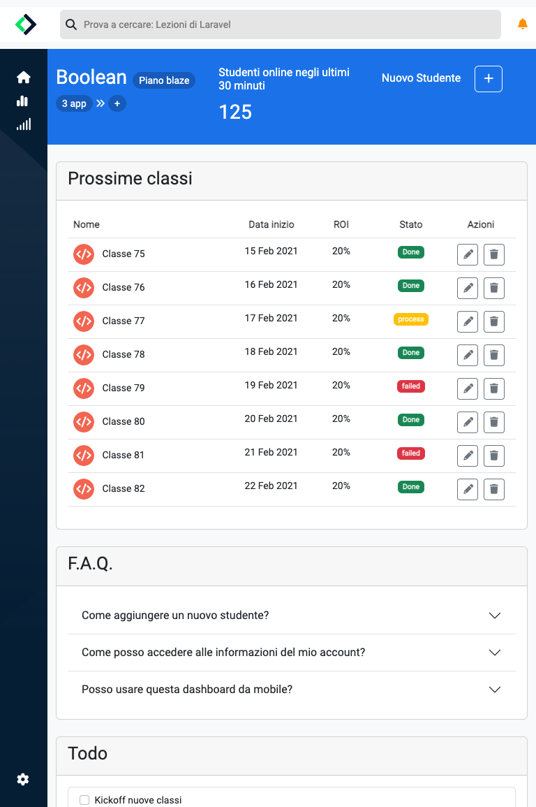

# Bootstrap Dashboard

L'obiettivo principale dell'esercizio è stato quello di ricreare il pannello di controllo di una dashboard basandoci sugli screenshot forniti e utilizzando Bootstrap 5 come framework di sviluppo.

## Font e stile

È stato utilizzato il carattere "Roboto" per un aspetto pulito e moderno.

## Layout Mobile

## Layout Tablet

## Layout Desktop

